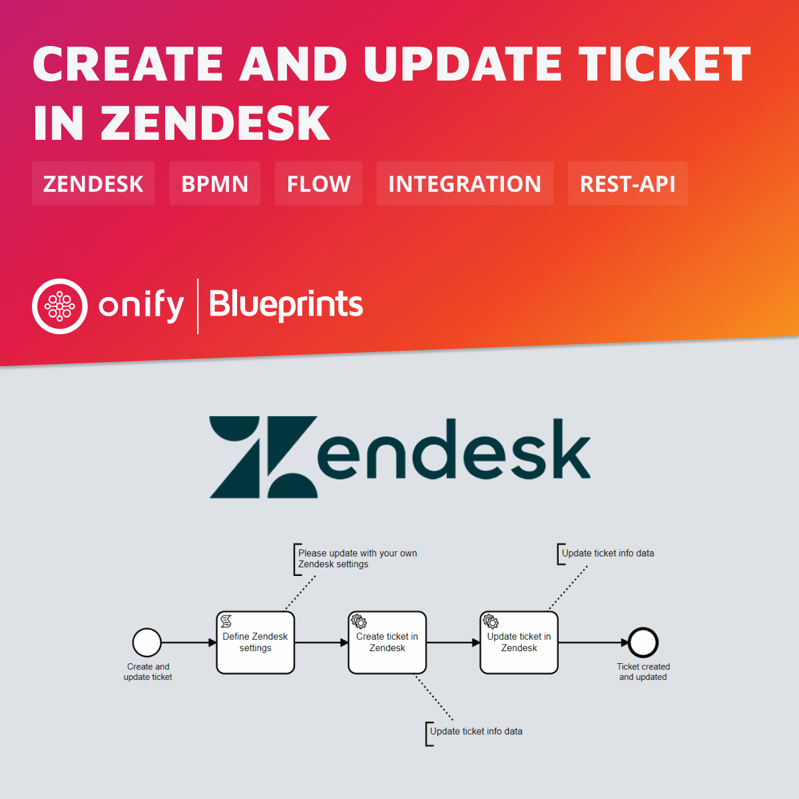

# Onify Blueprint: Create and update ticket in Zendesk

[Zendesk](https://zendesk.com/) is one of the most used ticketing and customer success solutions. In this Blueprint we show how to first create a new ticket and then update the same ticket using a BPMN process in Onify. Everyting is done through [Zendesk REST API](https://developer.zendesk.com/api-reference/).

## Requirements

* Onify Hub  
* Camunda Modeler
* Zendesk 

## Included

* 1 x Flows

## Setup

### Deploy

1. Open flow/bpmn in Camunda Modeler
2. Change settings/vars the the `Define Zendesk settings` task
3. 
4. Click `Deploy current diagram` and follow the steps

### Run 

To test and run the flow, click `Start Current Diagram`

## Support

* Community/forum: https://support.onify.co/discuss
* Documentation: https://support.onify.co/docs
* Support and SLA: https://support.onify.co/docs/get-support

## License

This project is licensed under the MIT License - see the [LICENSE](LICENSE) file for details.